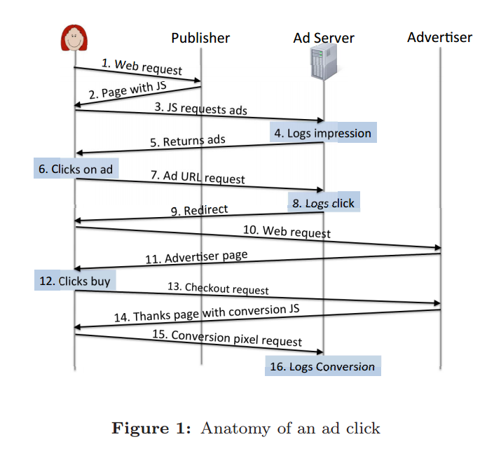

## Advertise Mode

### System structure
Online search advertising has three players: *Advertises*, *Publishers*, and *ad networks*

1. Advertiser
Advertisers are who want to advertise a product or service
2. Publishers
Publishers run websites(search engines, new sites, blog sites), mobile apps and games that display the ads. There are two kinds of publishers, 
	- *publishers owned by the ad network*, e.g., google.com shows ads from Google's ad network
	-  *publishers operated(O&O) by the  adnetwork*, e.g., ask.com is a syndicated publisher for Google ads
3. Ad Networks
Ad networks(like Google AdSense, Bing Ads, Baidu, and Tahoo) that connect advertisers with the publishers.

### Cost-per-Click(CPC) or Pay-per-Click(CPC)
It is the dominated charging model for search ads [[Parker-2012]](http://searchengineland.com/iab-pwc-search-still-tops-online-ad-revenues-and-share-grew-in-2011-118929). Advertisers pay the ad network only when their ad is clicked. Ad networks typically pay syndicated publishers 70% of the revenue generated by ad clicks on their site. 
- There are other charging models(e.g., pay per impression, pay per action), but this is not the dominate online ad revenues and ongoing trend. 

### Benefit/Cost analysis of each component
Note: the  analysis comes from paper [[Kshetri-2010]](../papers/Kshetri10_The-economics-of-click-fraud.md).

##### Click fraudster
- benefit
    - might include monetary gain and returns as well as psychic benefits such as enjoyment. 
- cost
    - monetary and psychic costs are functions of the probabilities associated with fraud detection, fines, arrest and conviction.
    - psychic costs include guilty feelings or other emotional penalties
  
##### PPC providers
- benefit
    - from valid clicks and might have a vested interest in labeling more clicks as valid ones.
    - in the short run, PPC providers such as Google and Yahoo benefits from the fraud their affiliates commit.
- cost
    - however, if a provider associated with fraud, then it might suffer from  a decline in reputation and bear a cost in the form of fewer opportunities to serve advertisers in the future.
    
##### Advertiser
- benefit 
    - benefits from high-quality clicks
        - however, a website visitor who clicked on an ad doesn't necessary buy the advertised product, i.e., **click-through rates** v.s. **conversion rates**
- cost
    - identify click fraud
    - for small companies, the cost could be high. According to an Inc magazine article, tools such as Click Lab, Click Defense, and Click Detectivem which are available to identity fake clicks, cost up to several thousand dollars per month. [[Penenberg-2005]](http://www.inc.com/magazine/20050801/marketing.html)
- current situation
    - a lack of build-in mechanisms to protect advertisers against click fraud
    

