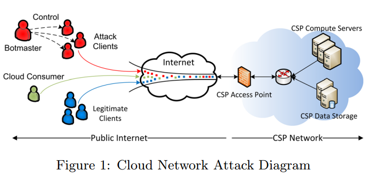

## Vulnerability

### Fradulent Resource Consumption(FRC) attack
- Ref: [[Idziorek-2011]](../../papers/IdziorekT11_CCSW_Detecting-Fraudulent-Use-of-Cloud-Resources.md)
- under the pay-as-you-go scheme, attackers could attack the economic sustainability of cloud consumers, i.e., the attackers could request web content in volumes that cost the cloud consumer a lot of money
- Cloud network attack diagram
  - 

