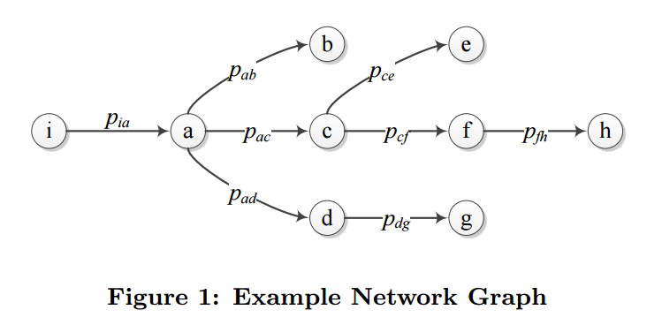

## Model

### Technical Terms
- **Adaptations**: adaptations are defined as a consequence of actions that change the system from on starting configuration to another valid configuration state. [[Zhuang15]](http://people.cis.ksu.edu/~sdeloach/publications/Conference/MTD15-attacktheory.pdf)

### Network graph
[[Rui-2014]](../papers/file/rui14-model.md) consider the following model

 
 
- In this model, each edge represent a probability that attackers can compromise a node from a previous nodes. And in order to attack a target, the attackers should compromise the whole path that leads to the target victim.
- They consider how to design the recover time (adption time)  to better guarantee the security of target protected node. 

### Attack interval distribution
- [DDoS attack](./files/ddos_attack_interval.md)
