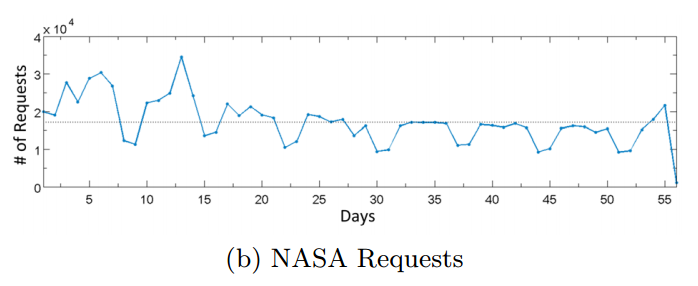

## [NASA Trace](ftp://ita.ee.lbl.gov/html/contrib/NASA-HTTP.html)

### Intro
The dataset is a historical web trace from a busy NASA web server.

### Characteristic
- from [[Idziorek-2011]](../papers/IdziorekT11_CCSW_Detecting-Fraudulent-Use-of-Cloud-Resources.md)
- Number of request per day
    

        
     

