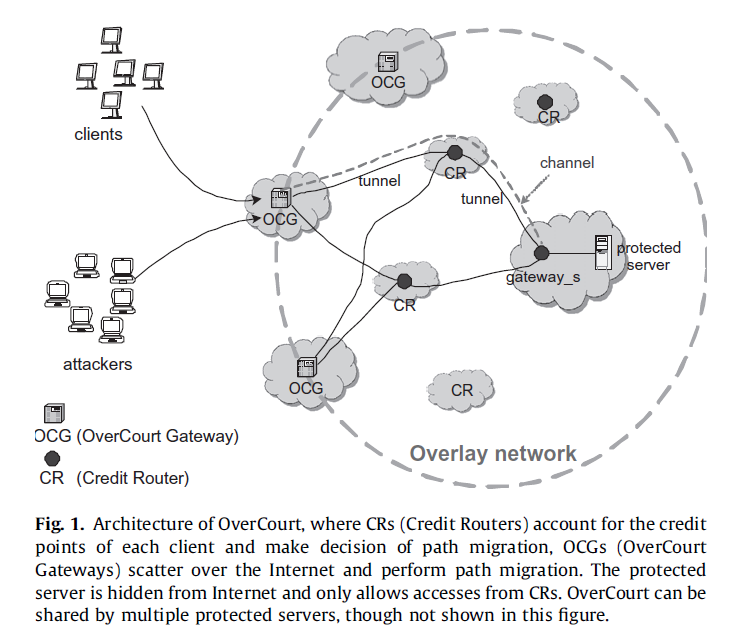

## [OverCourt: DDoS Mitigation through credit-based traffic segration and path mitigation](http://www.sciencedirect.com/science/article/pii/S0140366410004251)


- reading status: haven't started
- bib
```
@article{Du20102164,
    title = "OverCourt: \{DDoS\} mitigation through credit-based traffic segregation and path migration ",
    author = "Ping Du and Akihiro Nakao",
    journal = "Computer Communications ",
    volume = "33",
    number = "18",
    pages = "2164 - 2175",
    year = "2010"
}
```

### Summary
- In this paper, they propose an **overlay-based** DDoS mitigation architecture by introducing a **credit-based** accounting mechanism.

### Model
- Architecture (OverCourt)
    - Two classes of communication channel
        - VIP(very important person)
        - non-VIP 
    - The architecture is shown in the following figure.
    
   
    <p align="center">
    
    </p>
    
- Migrate
    - A well-behaving client may dynamically migrate to a protected channel when her credit points exceed a threshold while an ill-behaving client will be blocked after her credit points have been exhausted. 
    - Technical: since a path is established through a tunnel(virtual link), so we can migrate the traffic path of a well-behaving client from a non-VIP channel to a protected VIP channel

- Mechanism
    - clients with different credit points are served on different communication channels. 
    - a sender can send packets based on her credit points earned by her legitimate communication behaviors instead of expending resources in advance.
        - since the credit points given to a sender is designed to be measured based on her history of communication patterns, a well-behaving sender can gain her credit points while an ill-behaving one will lose her credit points. 
    

### Strongness

### Weakness


### Learned
- Setting threshold
    - The threshold of credit is set by the assumption that an attacker can be detected before he sends N packets, where N is a parameter
- Exhausting the credit table
    - Each incoming packet adds an item to the credit table in CRs may exhaust the table. To address this problem, we can delete the item that has not been updated in one minute with credit = c0. This will reduce the table size and has no side effect except that a client with a very low rate is forced to append a new item instead of updating an existing item for each incoming packets.    
    - My comments: `We may not need to worry about exhausting the table in our case since we only maintain a record for each client. In their case, they maintain a record for each packet. In addition, we can use the same approach to drop some items which have relative higher credits to reduce the table size. Note that it may not be suitable to drop items with low credits, otherwise, attackers  can take advantage of this to avoid being detected.`

### Extension

