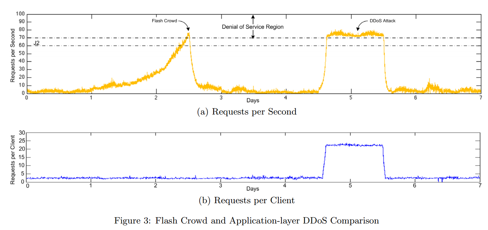

[Detecting Fraudulent Use of Cloud Resources]()
---

- reading status: 2014-10-03 ing
- bib
```
@inproceedings{IdziorekT11,
    author = {Idziorek, Joseph and Tannian, Mark and Jacobson, Doug},
    title = {Detecting Fraudulent Use of Cloud Resources},
    booktitle = {Proceedings of the 3rd ACM Workshop on Cloud Computing Security Workshop(CCSW)},
    year = {2011},
    pages = {61--72},
    numpages = {12}
} 
```

### Summary

### Model
- System Model
The following rles are defined in the context of cloud computing to provide a consistent reference to the actors that play in a FRC attack.
    - *Cloud Service Provider(CSP)**
      - The CSP(e.g., Amazon EC2 or Microsoft Azure) offers consumer-provisioned and metered computing resources that can be leased for flexible time durations.
    - *Cloud Consumer*
        - The cloud consumer is a person or organization that employs the services of a CSP and is financially responsible for resource consumption. 
        - The cloud consumer also plays a dual role of the victim.
    - *Client*
        - The client is a legitimate user that requests web content offered by the cloud consumer.
    - *Attacker*
        - Although a FRC attack is ultimately carried by one or more attack clients, the attackers(e.g., bot master) is the mastermined that orchestrates the FRC among the attack clients. 
    - *Attack Client*
        - The attack client is a malicious user(e.g., bot) that fraudulently consumes resources offered by the cloud consumer. 
- Utility Model
    - [Pay-As-You-Go](../Cloud/file/pricing.md)
    
### DDoS v.s. Flash Crowd
- Definition
    - Flash crowd: a significnat number of legitimae clients simultaneously requesting web content from a given site. Often triggered by a major news or sporting event, the individual clients that participate in this phenomenon are not malicious in nature.
- Similarity
    - traffic peak
- Difference
    - in DDoS attack, the average client request is high during the peak
    - in Flash Crowd, the average client request rate will decrease due to the decrease of QoS quality
- In the following figure, it shows a graph of request per second for a week-long web trace from a busy NASA web server [[NASA-Trace]](ftp://ita.ee.lbl.gov/html/contrib/NASA-HTTP.html)
    <div align = "center">
        
    </div>

### Detection Mechanism
- Detecting based on Zip law
    - Observation
        - In the normal case, the document request will satisfy Zip law.
        - However, for the FRC attack, attackers will have more interest in requesting for the documents that represent the majority of overall data usage. 
    - How it works?
        - computing the 90% regression slop of a sample data set
        - determine if the slope falls within a tolerance interval relative to normal activity
    - Resiliency
        - if the attacker want to avoid being detected, then the attackers to know the website's usage patterns
        
### Strongness

### Weakness


### Extensions

### TODO
- page 65: archive the related work on detection mechanism in this paper 
