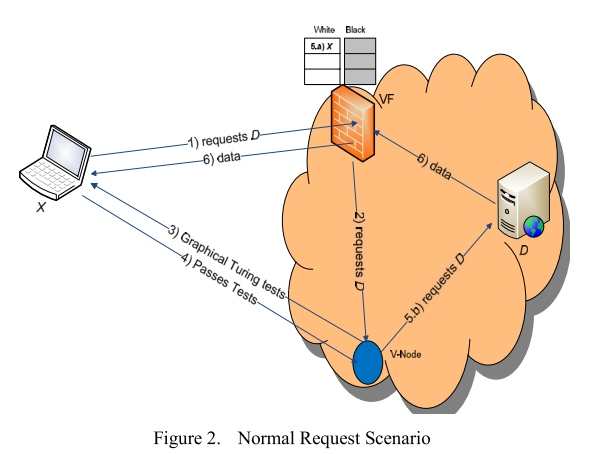

[EDoS-Shield: A Two-Steps Mitigation Technique against EDoS Attacks in Cloud Computing](http://ieeexplore.ieee.org/xpls/abs_all.jsp?arnumber=6123480&tag=1)
---

-  reading status: haven't started
- bib
```
@INPROCEEDINGS{SqalliA11, 
    author={Sqalli, M.H. and Al-Haidari, F. and Salah, K.}, 
    booktitle={Utility and Cloud Computing (UCC), 2011 Fourth IEEE International Conference on}, 
    title={EDoS-Shield - A Two-Steps Mitigation Technique against EDoS Attacks in Cloud Computing}, 
    year={2011}, 
    pages={49-56}
```

### Summary
In this paper, the authors propose a EDoS mitigating mechanism by verifying whether the requests are from legitimate users or bots. 

### System Architecture
- The following figures show the system architecure
<div text-align ="center" >
    
</div>
    - Virtual Firewall(VF): IP white and black list
    - V-Nodes: turing-test, captcha to verify whether it is human or bots

### Weakness
- The proposed mechanism use Turing test to verity legitimate clients from bots 
    - turing test could fail
    - it is unpleasant to users for dealing with the turing test or CAPTCHA
- block IP
    - NAT problem
    
### TODO
- record the related work of *load balancing" of firewall in page 52
- 